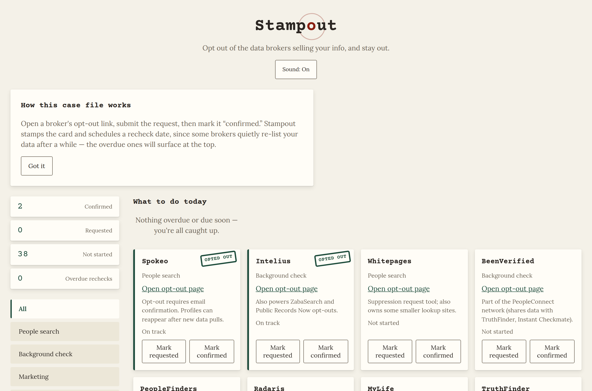

# Stampout

**▶ Live demo — [apps.charliekrug.com/optoutly](https://apps.charliekrug.com/optoutly/)**

[](https://github.com/ctkrug/optoutly/actions/workflows/ci.yml)
[](LICENSE)

Opt out of the data brokers selling your personal information, and stay opted out. Stampout is a
free, no-account checklist for the major US data brokers. It tracks which ones you have opted out
of, schedules a recheck for the brokers that quietly re-list you, and links each state's privacy
law so you know exactly what you can demand.

It is for anyone who wants off these sites without handing a subscription removal service the
name, address, and email they are trying to protect. You file each opt-out yourself; Stampout
remembers what you have done and when to come back.



## Why this exists

Data brokers build a profile of you from public records and sell it to people-search sites,
background-check services, and marketing lists. Most let you opt out, but:

- there are dozens of them, each with a different opt-out flow;
- several rebuild their profiles from fresh data pulls, so a listing you removed reappears months
  later; and
- your actual legal rights (to delete, to know, to correct) depend on which state you live in.

Paid services will file opt-outs for you for a recurring fee, which means giving them the exact
data you want kept private. Stampout takes the other approach: it costs nothing, keeps your
progress in your browser, and shows you every broker so you stay in control of what gets filed.

## How to use it

1. **Open** a broker's opt-out page from its card and submit the request. Mark it **requested**.
2. **Confirm** it once the broker removes you. The card gets a rubber-stamp "OPTED OUT" and a
   recheck date based on how quickly that broker is known to re-list people.
3. **Come back** when something is due. The *What to do today* view shows only the brokers that
   are overdue or due soon, most urgent first.

Your progress is saved in `localStorage`. Use **Export progress** to save it as a JSON file and
**Import progress** to move it to another browser or device.

## Features

- **Broker checklist:** 40 major US brokers with name, category, and a direct opt-out link.
- **Status tracking:** mark each broker not started / requested / confirmed, with a rubber-stamp
  animation and a synthesized sound (mutable) on confirm.
- **Recheck scheduler:** brokers known to re-list get a "check again by" date computed from your
  last confirmed opt-out; overdue ones surface first.
- **"What to do today":** a focused view of just the overdue and due-soon brokers.
- **Category filters:** narrow the checklist to people-search, background-check, marketing, or
  credit-marketing.
- **State privacy-law reference:** pick any US state or DC and see which comprehensive privacy
  law applies (CCPA/CPRA, VCDPA, and the rest), the rights it grants, or a note if none is in
  force yet.
- **Import / export:** carry your opt-out status between browsers as a JSON file.
- **Stale-data notice:** a visible warning if the shipped dataset has not been reviewed in over
  90 days.
- **Zero backend:** a static page; your data never leaves your browser.

## Run it locally

```
npm install     # dev-only tooling (test runner deps + eslint)
npm test        # run the test suite
npm run lint    # run eslint
```

To preview the site, serve `public/` with any static file server:

```
npx http-server public
```

There is no build step. `public/` is the whole deployable site and uses only relative paths, so
it can be hosted at a domain root or on a subpath.

## How it works

Vanilla JavaScript ES modules, no framework and no bundler. The pure logic lives in
`public/js/lib/` and is unit-tested in isolation; the render layer builds the DOM and is tested
with `linkedom`. The broker list and state-law table are static JSON in `public/data/`, guarded
by a data-contract test so a malformed dataset fails CI rather than the page.

```
public/            the whole deployable site (self-contained, relative paths)
  index.html
  css/
  js/
    lib/           pure logic: scheduler, storage, broker-status, states, sound
    render.js      DOM rendering
    app.js         boot + wiring
  data/            brokers.json, state-laws.json
test/              node:test suites: pure logic, date-math properties,
                   data contract, and DOM render integration
docs/              VISION, DESIGN, ARCHITECTURE, BACKLOG
```

See [`docs/ARCHITECTURE.md`](docs/ARCHITECTURE.md) for the module map and data flow.

## A note on accuracy

Opt-out URLs and state privacy laws change. The dataset carries an `updated` date and the page
warns when it is stale. Always confirm the opt-out on the broker's own site; Stampout points you
to the right page and tracks your progress, it does not submit anything for you.

## License

MIT. See [`LICENSE`](LICENSE).

More of Charlie's projects → https://apps.charliekrug.com
